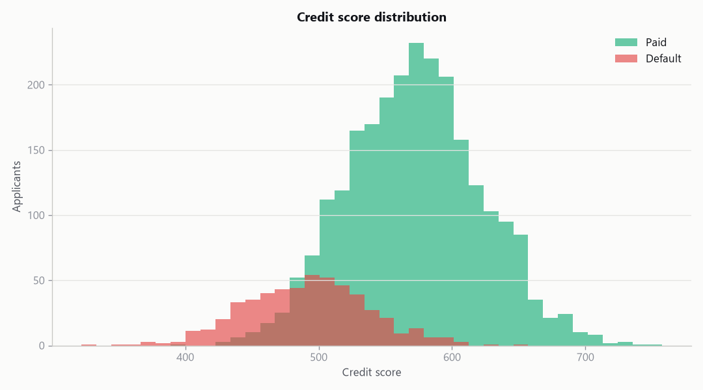
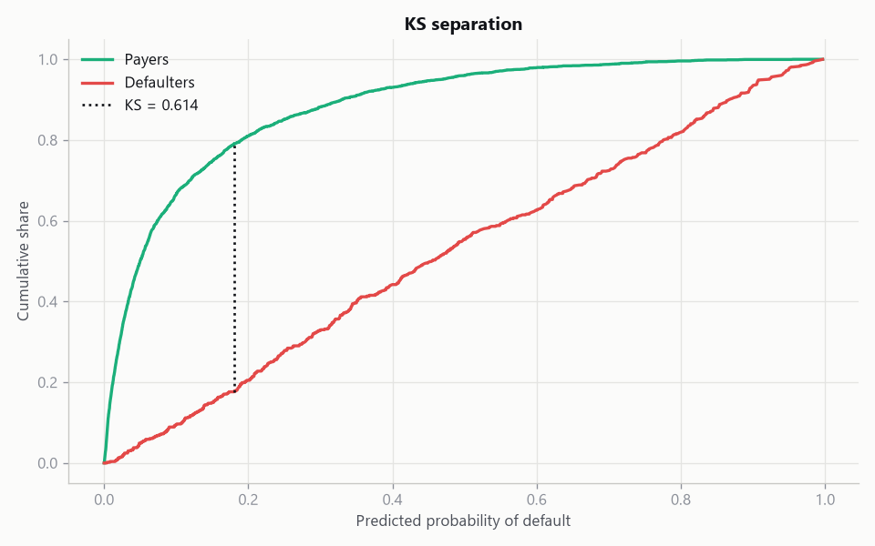

# Credit Risk Analysis

A credit scoring pipeline that estimates the probability a borrower defaults,
turns that probability into a points-based credit score, and sorts applicants
into risk bands. It runs out of the box on a realistic synthetic loan book, and
will use your own CSV if you have one.

The model is a logistic regression on purpose. A boosted tree might rank
applicants slightly better, but in lending you usually have to explain why
someone was declined, and a linear model in log-odds is about as explainable as
it gets. Every feature maps to a clear, signed contribution to default odds.

## Example output

These come from the built-in synthetic data (12,000 loans, seed 42) and are
reproducible with `python scripts/run_credit_model.py --save-plots`.

```
Model performance (test set)
AUC            0.8821
Gini           0.7643
KS statistic   0.6141
Default rate   0.1757
```

The score distribution separates payers from defaulters, and the ROC and KS
charts quantify that separation:

| Score distribution | KS separation |
|--------------------|---------------|
|  |  |

Sorted into bands, the average default probability rises cleanly from the safest
tier to the riskiest, which is exactly what a usable scorecard should do:

| Band | Avg probability of default |
|------|----------------------------|
| A (very low risk) | ~0.0% |
| B (low risk)      | ~0.1% |
| C (medium risk)   | ~1% |
| D (high risk)     | ~6% |
| E (very high risk)| ~41% |

## What it measures, and why these metrics

| Metric | Meaning |
|--------|---------|
| AUC    | Probability a random defaulter is ranked riskier than a random payer |
| Gini   | `2 * AUC - 1`, the same information on the scale lenders quote |
| KS     | The largest gap between the payer and defaulter score distributions |
| Calibration | Whether a predicted 10% default rate really defaults about 10% of the time |

Ranking and calibration are different things. AUC, Gini, and KS all measure
*ranking* (does the model put riskier borrowers higher?). Calibration measures
whether the probabilities are *honest*. A scorecard needs both, which is why the
model is left un-rebalanced: rebalancing class weights would improve a hard
classification report at the cost of distorting the probabilities the score is
built from.

## The scorecard

A raw probability is hard to act on, so it is mapped to a points score using the
standard "points to double the odds" construction (the same idea behind scores
like FICO):

```
odds  = (1 - PD) / PD
score = offset + factor * ln(odds),   factor = pdo / ln(2)
```

A lower probability of default means higher odds of being a good payer, so it
maps to a higher score. Each fixed block of points (20 by default) doubles the
odds of being good.

## How it works

| Module        | Responsibility                                              |
|---------------|-------------------------------------------------------------|
| `data.py`     | Generate a feature-driven synthetic loan book, or load a CSV |
| `model.py`    | Preprocess and fit the logistic-regression model            |
| `metrics.py`  | AUC, Gini, KS, confusion matrix, calibration table          |
| `scorecard.py`| Convert probability of default to a score and risk band     |
| `plotting.py` | ROC, KS, score distribution, and calibration charts         |

## Getting started

```bash
git clone https://github.com/KelsonLam/credit-risk-analysis.git
cd credit-risk-analysis
pip install -r requirements.txt
python scripts/run_credit_model.py
```

To use a real dataset, set `data.csv_path` in `config.yaml` (or pass `--csv`),
with the default flag in the column named by `data.target_column`.

## Being honest about the data and the model

- **The default dataset is synthetic.** It is generated so that the features
  genuinely drive the default flag, which makes it a fair test of the pipeline,
  but it is not real borrower data and says nothing about real borrowers. Point
  the model at a real CSV to draw real conclusions.
- **A real scorecard needs more.** Production credit models add Weight of
  Evidence binning, information-value feature screening, reject inference,
  population-stability monitoring, and fair-lending review. This is the modelling
  core, not the whole governance process around it.
- **No fairness audit here.** Using attributes that proxy for protected classes
  is both a legal and an ethical problem in real lending. A real build would
  test for disparate impact. This baseline does not.

## Tests

```bash
pip install pytest
pytest
```

The suite checks that the synthetic default rate lands near its target, that the
model recovers the signal (AUC well above chance), that KS and Gini stay in
range, that the score falls as default probability rises, that doubling the odds
adds exactly the configured points, and that the CSV loader falls back to
synthetic data when no file is present.

## Project layout

```
credit-risk-analysis/
├── config.yaml
├── requirements.txt
├── scripts/
│   └── run_credit_model.py
├── src/credit_risk/
│   ├── data.py
│   ├── model.py
│   ├── metrics.py
│   ├── scorecard.py
│   └── plotting.py
└── tests/
    └── test_credit.py
```

## License

MIT. See [LICENSE](LICENSE).
